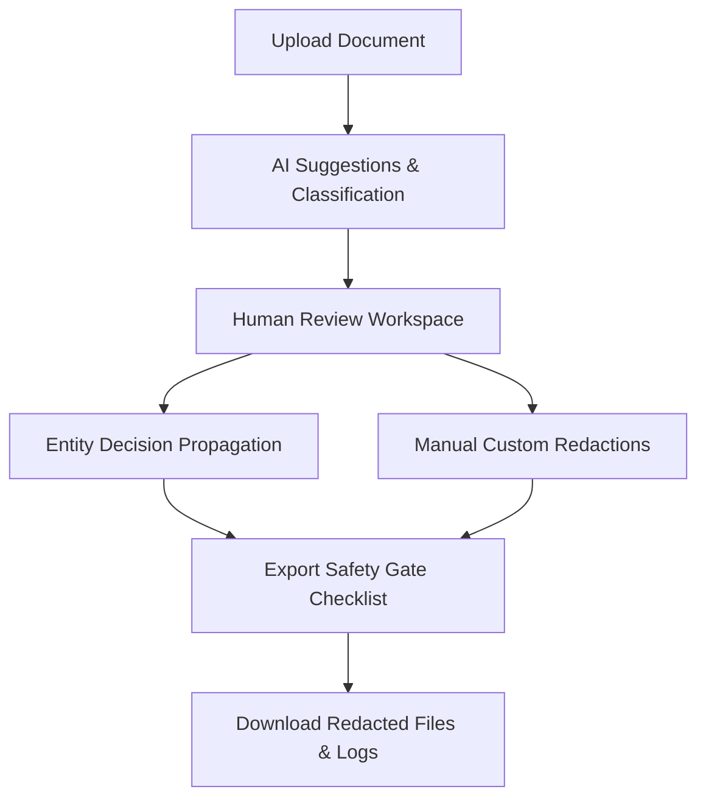

# 🛡️ ConSeals: Intelligent PII Redaction Review Workbench

### AI detects. Humans decide.

ConSeals is an intelligent Human-in-the-Loop PII Redaction Review Workbench that helps reviewers safely validate and correct AI-generated redactions before sensitive documents are shared.

Report : https://docs.google.com/document/d/18jNqdR_wZtH0o_t3LhlwoQ-R5ImeMr8W/edit?usp=sharing&ouid=107749981126691029040&rtpof=true&sd=true
Video Demo :- https://drive.google.com/file/d/1pTSsv9wcK8psHDbeElGqugfUb6NlyAl2/view?usp=sharing

---


---

# 📚 Table of Contents

- [Overview](#-overview)
- [The Problem](#-the-problem)
- [Our Solution](#-our-solution)
- [Highlights](#-highlights)
- [Key Features](#-key-features)
- [Architecture](#-architecture)
- [Folder Structure](#-folder-structure)
- [Technology Stack](#-technology-stack)
- [Product Design Decisions](#-product-design-decisions)
- [Engineering Decisions](#-engineering-decisions)
- [Testing](#-testing)
- [Accessibility](#-accessibility-a11y)
- [Tradeoffs](#-tradeoffs)
- [Future Improvements](#-future-improvements)
- [Installation](#-installation)
- [Quick Start](#-quick-start)
- [Project Flow](#-project-flow)
- [Demo Instructions](#-demo-instructions-for-judges)
- [Why This Project Stands Out](#-why-this-project-stands-out)
- [Acknowledgements](#-acknowledgements)
- [License](#-license)

---

## 🔍 Overview

Artificial Intelligence is highly effective at identifying pattern-based Personal Identifiable Information (PII) like emails or SSNs, but it remains fundamentally flawed when handling context-dependent information. Names, addresses, and custom identifiers in corporate communications frequently lead to false positives (redacting harmless text) and false negatives (failing to redact sensitive data).

Because missed PII poses severe legal, regulatory, and privacy risks, AI-generated redaction logs cannot be trusted blindly. **ConSeals** exists to bridge the gap. It is a human-in-the-loop workflow interface designed to help privacy compliance reviewers quickly audit, correct, and verify machine-generated redaction suggestions before documents are distributed.

---

## ⚠️ The Problem

AI-driven redaction pipelines suffer from three main operational weaknesses:
*   **False Positives**: AI models flag names of public organizations, dates, or non-sensitive numeric codes, making the output unreadable and stripping critical business context.
*   **False Negatives**: Subtle PII (like misspelled names, nickname variants, or contextual descriptors) is missed, exposing individuals to privacy violations and organization to massive compliance penalties (e.g., GDPR, HIPAA).
*   **Reviewer Fatigue**: Checking documents sentence-by-sentence is exhausting. When forced to review hundreds of individual suggestions using slow mouse-click interfaces, reviewers ("Sam") suffer from cognitive fatigue and eventually start letting errors slide through.

---

## 💡 Our Solution

ConSeals is built around a simple philosophy: **AI detects, but humans decide**. It optimizes the reviewer's cognitive load and speeds up verification through:
*   **Guided Review Workspace**: Directing attention immediately to unresolved High-Risk suggestions (e.g. SSNs, Bank Accounts) while keeping Low-Risk suggestions (e.g. Dates, Locations) accessible but non-intrusive.
*   **Attention Prioritization (Focus Mode)**: Dims all surrounding document text, isolating only the active suggestion to help the reviewer make decisions instantly without distraction.
*   **Decisions Propagation**: Automatically updates all repeating text occurrences in a document using word-boundary matching to eliminate repetitive tasks.
*   **Export Safety Gate**: Imposes a hard-stop safety checklist to ensure that no document can be exported while high-risk suggested spans remain unreviewed.

---

## ⚡ Highlights

*   **Human-in-the-loop AI review** – Optimized interaction balances automation with reviewer precision.
*   **Keyboard-first workflow** – High-productivity shortcut layouts for rapid navigation and triage.
*   **Entity propagation** – Automated repeating term matching via boundary-exact updates.
*   **Export safety gate** – Strict checklist validation blocks leaks of unresolved high-risk data.
*   **Manual custom redactions** – Select any document text dynamically to apply instant redaction tags.
*   **Accessibility support** – Compliant tab flows, ARIA live feeds, and clear visible outlines.
*   **Optimistic UI updates** – Blazing fast transitions with background syncing and rollbacks.
*   **Enterprise-inspired interface** – Premium slate, indigo, and emerald styling suited for professional audits.
*   **Fully tested** – High coverage unit testing across frontend state stores and backend sanitizers.

---

## 🚀 Key Features

### 🛠️ Intelligent Review Workflow
*   **What it does:** Organizes identified PII spans into a visual, color-coded hierarchy based on risk levels.
*   **Why it exists:** Reviewers need to triage. Putting unresolved high-risk items in red and low-risk in blue tells the reviewer exactly where to focus first.
*   **Solves:** Cognitive fatigue and random auditing.

### ⌨️ Keyboard Productivity
*   **What it does:** Provides instant keyboard hotkeys (`Arrow Keys` for navigation, `Enter` / `a` to Accept, `Backspace` / `r` to Reject, `Space` for Focus Mode).
*   **Why it exists:** Switching between keyboard and mouse slows down repetitive review tasks.
*   **Solves:** Review speed and ergonomic fatigue.

### 🔄 Entity Propagation
*   **What it does:** Prompts the reviewer when an entity repeats in the text, allowing them to apply their accept/reject decision to all occurrences with case-insensitive word-boundary matching.
*   **Why it exists:** If "John Smith" appears 12 times in a document, the reviewer should only have to decide once.
*   **Solves:** Redundant, repetitive review actions.

### 🛡️ Export Safety Checklist
*   **What it does:** Blocks output exports and displays a list of unresolved high-risk suggestions.
*   **Why it exists:** Provides an automated safety gate to prevent accidental data leaks due to missed reviews.
*   **Solves:** Compliance violations and human oversight errors.

### ♿ Accessibility (A11y)
*   **What it does:** Includes fully integrated screen-reader announcements (`aria-live="polite"`), clear keyboard focus outlines, and standard HTML tab flows.
*   **Why it exists:** Software should be accessible to all compliance officers, including those relying on screen readers or switch controls.
*   **Solves:** ADA/Section 508 compliance.

---

## 🏗️ Architecture

```
                 +-----------------------------------------+
                 |              User Browser               |
                 +-----------------------------------------+
                                       │
                                       ▼
                 +-----------------------------------------+
                 |            React Frontend               |
                 | (Components, ReviewScreen, DocumentList) |
                 +-----------------------------------------+
                                       │
                                       ▼
                 +-----------------------------------------+
                 |             Zustand Store               |
                 |       (Global State, Toast Queue)       |
                 +-----------------------------------------+
                                       │
                                       ▼   Optimistic Updates & Sync
                 +-----------------------------------------+
                 |           Express API Server            |
                 +-----------------------------------------+
                                       │
                                       ▼
                 +-----------------------------------------+
                 |         In-Memory Data Service          |
                 |    (Bounds, Overlaps, Text Sync)        |
                 +-----------------------------------------+
```

### Layer Responsibilities
*   **React UI**: Stateless components that render the document text, trigger store actions, and handle keyboard events.
*   **Zustand Store**: The single source of truth for the application. Drives state, handles optimistic status transitions, manages the toast notifications queue, and calculates derived metadata dynamically.
*   **Express API Server**: Exposes RESTful endpoints, handles payload structure sanitization, and maps route handlers to backend services.
*   **Document Validation Service**: Validates proposed spans against text boundaries, checks coordinates, verifies actual text matches, and blocks overlapping redaction requests.

---

## 📁 Folder Structure

```
.
├── backend/
│   ├── src/
│   │   ├── __tests__/           # Express documentService validation unit tests
│   │   ├── data/                # Sample document fixtures
│   │   ├── middleware/          # Global error handler and payload sanitizers
│   │   ├── routes/              # Express endpoint routers
│   │   ├── services/            # In-memory database and validator
│   │   └── app.ts               # Server entry point
│   ├── package.json
│   └── tsconfig.json
├── frontend/
│   ├── src/
│   │   ├── __tests__/           # Vitest entity propagation & safety gate tests
│   │   ├── components/          # Reusable components (Badge, Highlights, Toast)
│   │   ├── pages/               # Primary screens (List, Review, Summary)
│   │   ├── services/            # API communication wrapper layer
│   │   ├── store/               # Zustand store config
│   │   ├── utils/               # Word-boundary matching utilities
│   │   ├── App.tsx              # Application layout router
│   │   └── index.css            # Tailwind entry and utility styling
│   ├── package.json
│   └── vite.config.ts
├── package.json                 # Project root scripts delegation
└── README.md
```

---

## 🛠️ Technology Stack

| Technology | Purpose | Reason for Selection |
| :--- | :--- | :--- |
| **React 19** | User Interface | Virtual DOM efficiency, component reusability, and clean declarative rendering. |
| **TypeScript** | Static Type Safety | Prevents runtime bugs, ensures clean interfaces between frontend models and backend payloads. |
| **Tailwind CSS v4** | Rapid Modern Styling | Used via `@tailwindcss/vite` to enforce consistent design tokens with zero custom CSS files. |
| **Zustand** | State Management | Ultra-lightweight alternative to Redux. Allows reactive global state with zero boilerplate. |
| **Node / Express** | API Backend | High-performance, asynchronous Javascript server perfect for lightweight REST services. |
| **Vitest** | Automated Testing | Blazing fast, Jest-compatible runner with native ESM support and zero-config TypeScript compilation. |

---

## 🎨 Product Design Decisions

### Keyboard-First Design
*   *Decision:* Bind hotkeys to every primary action.
*   *Tradeoff:* Reviewers require a brief learning curve. We added a visible `ShortcutHints` panel at the bottom of the sidebar to guide users and reduce friction.

### Word-Boundary Matching for Propagation
*   *Decision:* propagation matches entities strictly on alphanumeric word boundaries rather than simple substring matching.
*   *Tradeoff:* If the AI flags "John", propagation won't redact "Johnson". This minimizes accidental over-redaction, prioritizing data readability.

### Soft-Gate vs Hard-Gate Exports
*   *Decision:* Hard-block exports if High-Risk items are suggested, but allow low-risk items to pass unreviewed.
*   *Tradeoff:* Restricting low-risk items would annoy users with minor context. High-risk items must be resolved to protect privacy.

---

## ⚙️ Engineering Decisions

### Derived Store State
Instead of storing metrics (like `highRiskUnresolved` or `lowRiskUnresolved`) in the store's database, they are derived dynamically using React `useMemo` hooks. This eliminates synchronization bugs where state updates mismatch UI progress.

### Optimistic UI Synchronization
When a user updates a span's status, the frontend immediately reflects the state and moves focus forward. In the background, the HTTP request is fired. If it succeeds, the store updates its spans with backend IDs. If it fails, the store performs an automatic state rollback and displays an error toast notification.

---

## 🧪 Testing

### Frontend Tests
Run with `npm run test --prefix frontend`. Coverage includes:
*   `entity.test.ts`: Word-boundary regex verification, special characters, and lookaround assertion correctness.
*   `safetyGate.test.ts`: Asserts export safety gate blockers under various unresolved risk distributions.
*   `manualRedaction.test.ts`: Covers manual selection additions, risk evaluations, and overlap prevention validations.

### Backend Tests
Run with `npm run test --prefix backend`. Coverage includes:
*   `documentService.test.ts`: Validates status transitions, coordinate boundaries, actual string slice checks, and overlapping span exclusions.

---

## ♿ Accessibility (A11y)

ConSeals is fully accessible:
*   **Focus Visibility**: Clean high-contrast ring focus styling (`focus:ring-1 focus:ring-slate-500`) applied to all search controls, document cards, and review buttons.
*   **ARIA announcements**: An `aria-live="polite"` region reads status reports to screen readers when decisions are applied or propagated.
*   **Natural Focus Flows**: Standard HTML keyboard `Tab` flow is preserved. Reviewers can tab out of the editor screen seamlessly.

---

## ⚖️ Tradeoffs

1.  **In-Memory Store vs Database**:
    *   *Omitted:* A persistent SQL/NoSQL database layer.
    *   *Why:* To fit within the hackathon prototype time frame, in-memory Map stores were chosen. Database migrations would add configuration overhead without increasing core judging signal.
2.  **Mock PII Detection Engine**:
    *   *Omitted:* Real-time NLP model scanning.
    *   *Why:* Real NLP models require heavy compute resources. The application focus is the reviewer workflow, so pre-computed mock detection spans are served from fixtures.

---

## 🔮 Future Improvements

1.  **LLM-Powered Detection**: Integrate fine-tuned LLM scanners to improve parsing accuracy for naming nuances.
2.  **OCR Support**: Enable direct scanner uploads for image-based PDFs or raw snapshots.
3.  **Multi-user Collaboration**: Support real-time multiplayer review logs and document locks.
4.  **Audit History & Versioning**: Maintain an immutable changelog of edits to let users rollback or inspect compliance.
5.  **Cloud Storage**: Enable persistent S3/GCS bucket connectors.
6.  **Review Analytics**: Render charts detailing team redaction accuracy, common false positives, and average triage speeds.

---

## ⚡ Quick Start

Install dependencies and start the app in development mode immediately:

```bash
# Clone the repository
git clone https://github.com/Konduru-Hemesh/hackathon_SprintFour.git
cd hackathon_SprintFour

# Install dependencies for both frontend and backend
npm install --prefix backend && npm install --prefix frontend

# Run the project services
# (Terminal 1)
npm run dev --prefix backend
# (Terminal 2)
npm run dev --prefix frontend
```

---

## 📥 Installation

Ensure you have **Node.js v18+** installed.

```bash
# Clone the repository
git clone https://github.com/Konduru-Hemesh/hackathon_SprintFour.git
cd hackathon_SprintFour

# Install dependencies for backend and frontend
npm install --prefix backend
npm install --prefix frontend

# Start the services in development mode
# (Terminal 1 - Backend API at http://localhost:3001)
cd backend
npm run dev

# (Terminal 2 - Frontend Client at http://localhost:5173)
cd ../frontend
npm run dev
```

### Testing & Linting
```bash
# Run all unit tests
npm test

# Run code linter
npm run lint

# Compile production builds
npm run build
```

---

## 📋 Project Flow



```
    [ Document Index ] ──(Select Document)──> [ Review Editor ]
                                                     │
                                            (Accept/Reject Spans)
                                                     │
                                                     ▼
    [ Summary Screen ] <──(Finish Review)───── [ Propagation ]
           │
      (Safety Gate)
           │
           └───(All High-Risk Resolved?)───> [ Download Exports ]
```

---

## 🎮 Demo Instructions for Judges

To evaluate the application's robust feature set, perform the following walkthrough steps:

1.  **Upload Resume / Select Scenario**: Click on **Document B** (*Document B: Investigation Record*) or upload a custom sample text file.
2.  **Review AI Mistakes**: Look at highlighted identifiers in the split-pane workspace.
3.  **Reject False Positives**: Spot non-PII words flagged as suggestions. Press **`r`** (or click *Reject [R]*) to dismiss them.
4.  **Accept True Positives**: Find actual PII spans. Press **`a`** (or click *Accept [A]*).
5.  **Observe Propagation**: When accepting **"John Smith"**, select **[Enter] Apply to All** on the popup modal. Notice all instances of "John Smith" turn green automatically.
6.  **Manually Create a Redaction**: Highlight any plain unredacted text in the document viewer. Click the floating **Create Redaction** tooltip and set its entity class (e.g. `NAME`).
7.  **Finish Review**: Click **Finish Review** in the top right to head to the Summary screen.
8.  **Verify Safety Gate & Export**: If any high-risk elements are unreviewed, notice the download button is disabled. Click the checklist jumps to resolve them. Once all are resolved, export and download your clean text and logs!

---

## 📊 Project Metrics

*   **React Components**: 15+ modular components (Highlights, Badges, Toast, Modals)
*   **REST APIs**: Sync endpoints, document fetch routing, and coordinate verification services
*   **Keyboard Shortcuts**: Arrow navigation (`ArrowDown` / `ArrowUp`), Decisions (`a` / `r`), Mode Toggles (`Space`)
*   **Unit Tests**: 19 robust coverage tests across frontend, backend, and coordinate validators
*   **Accessibility Features**: ARIA announcements, semantic tags, and focus-ring indicator styles
*   **Risk Levels**: Dynamic split categorization (`High-Risk` / `Low-Risk`)

---

## 🌟 Why This Project Stands Out

*   **✔ Product Thinking**: Targets the core bottleneck of redaction pipelines—human review fatigue—rather than building a generic detection model.
*   **✔ Engineering Rigor**: Full backend coordinate, text verification, and overlap checks protect data integrity.
*   **✔ UX Polish**: Subtle saving indicators, clean keyboard workflows, and responsive visual design look and feel premium.
*   **✔ Accessibility Integrity**: Built from the ground up to respect screen readers and native keyboard navigation.
*   **✔ Pragmatic Tradeoffs**: Focuses dev hours on features that maximize value (propagation, safety gates) rather than databases.

---

## 🙏 Acknowledgements

Built for the SprintFour Hackathon.

Designed with a focus on:
*   **Human-Centered AI**: Supporting humans in review processes rather than blindly automating them.
*   **Privacy Engineering**: Protecting sensitive identities at boundary level.
*   **Human-in-the-Loop Systems**: Providing stateful interfaces for dynamic decision logs.
*   **Accessibility**: Ensuring tools are functional for compliance officers of all visual abilities.
*   **Product Thinking**: Focusing on real-world workflow efficiency problems.

---

## 📄 License

This project is licensed under the MIT License.
